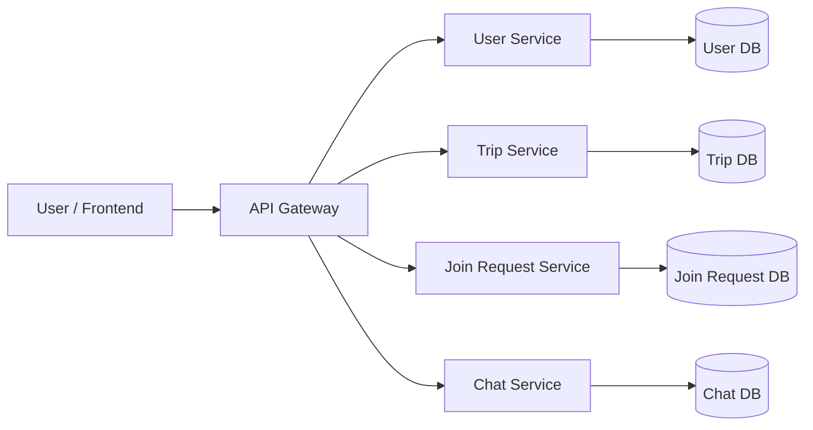
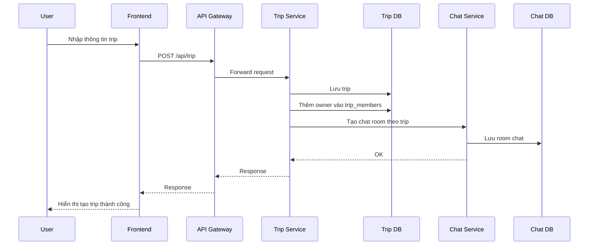
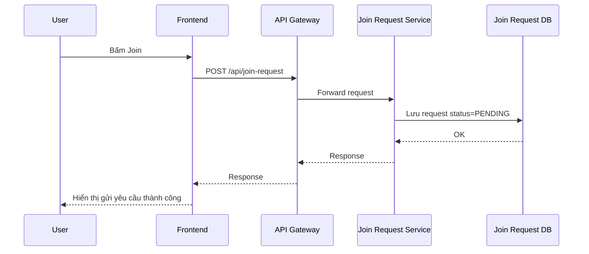
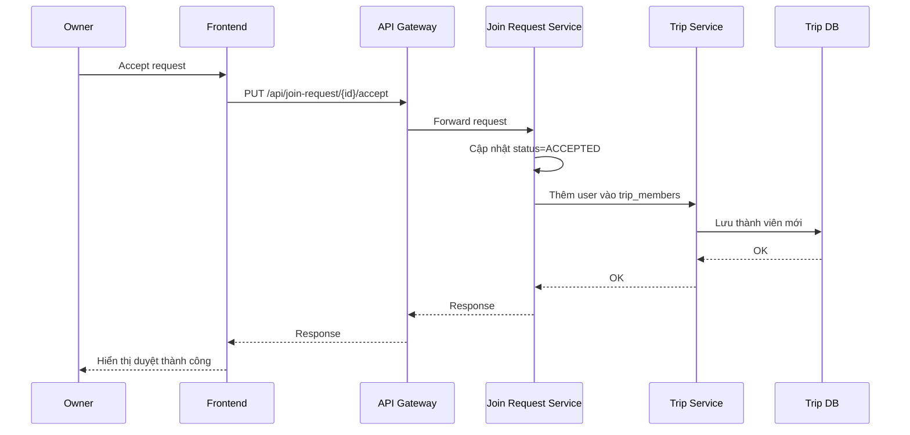
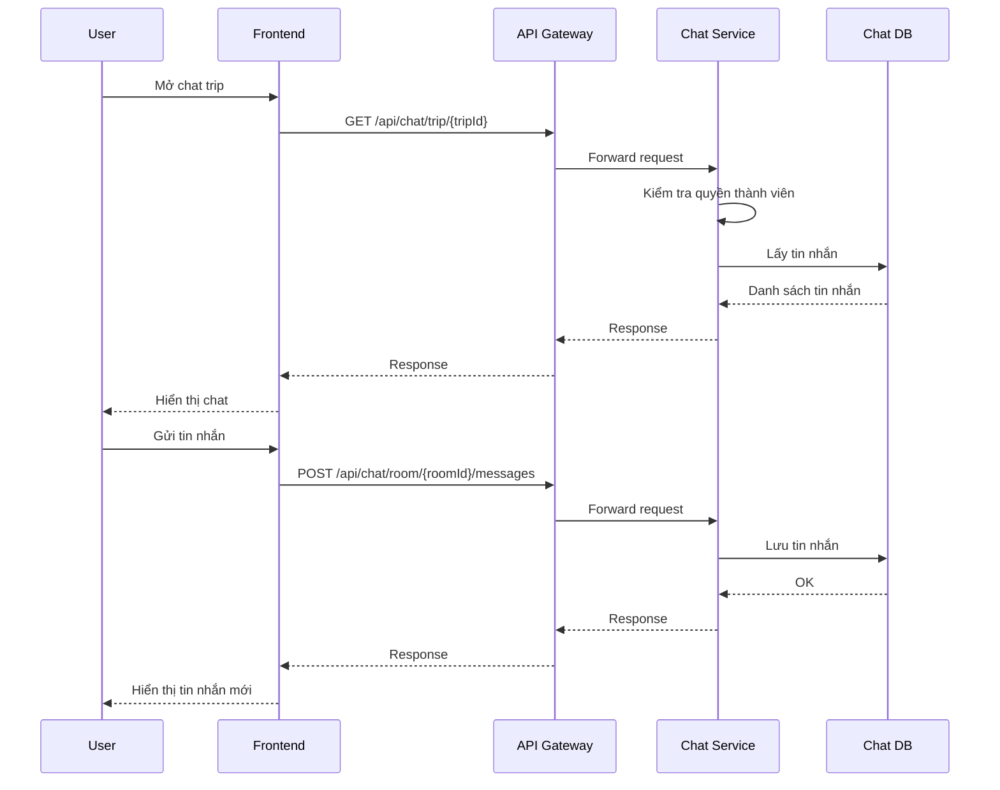

# Plan chi tiết đồ án: Hệ thống kết nối bạn đồng hành du lịch theo kiến trúc Microservice có tích hợp chat nhóm

> Tài liệu kế hoạch triển khai đồ án sinh viên cho hệ thống tìm bạn đồng hành du lịch theo kiến trúc microservice, hỗ trợ tạo chuyến đi, tham gia chuyến đi và trò chuyện nhóm giữa các thành viên.

---

## Mục lục
- [1. Thông tin đề tài](#1-thông-tin-đề-tài)
- [2. Mục tiêu đề tài](#2-mục-tiêu-đề-tài)
- [3. Phạm vi chức năng](#3-phạm-vi-chức-năng)
- [4. Kiến trúc hệ thống](#4-kiến-trúc-hệ-thống)
- [5. Luồng hoạt động chính](#5-luồng-hoạt-động-chính)
- [6. Thiết kế cơ sở dữ liệu](#6-thiết-kế-cơ-sở-dữ-liệu)
- [7. Danh sách API](#7-danh-sách-api)
- [8. Quy tắc nghiệp vụ](#8-quy-tắc-nghiệp-vụ)
- [9. Công nghệ đề xuất](#9-công-nghệ-đề-xuất)
- [10. Kế hoạch thực hiện](#10-kế-hoạch-thực-hiện)
- [11. Timeline theo tuần](#11-timeline-theo-tuần)
- [12. Checklist triển khai](#12-checklist-triển-khai)
- [13. Cấu trúc thư mục gợi ý](#13-cấu-trúc-thư-mục-gợi-ý)
- [14. Sơ đồ cần làm trong báo cáo](#14-sơ-đồ-cần-làm-trong-báo-cáo)
- [15. Kịch bản demo](#15-kịch-bản-demo)
- [16. Hướng phát triển tương lai](#16-hướng-phát-triển-tương-lai)
- [17. Kết luận](#17-kết-luận)

---

## 1. Thông tin đề tài

### 1.1. Tên đề tài
**Xây dựng hệ thống kết nối bạn đồng hành du lịch theo kiến trúc Microservice có tích hợp chat nhóm**

### 1.2. Tên tiếng Anh gợi ý
**Travel Companion Matching System based on Microservice Architecture with Group Chat Integration**

### 1.3. Ý tưởng cốt lõi
Hệ thống cho phép người dùng:
- đăng ký và đăng nhập
- tạo chuyến đi
- tìm kiếm chuyến đi
- gửi yêu cầu tham gia chuyến đi
- chủ chuyến đi duyệt yêu cầu tham gia
- những thành viên đã được chấp nhận có thể trò chuyện trong nhóm chat của trip

---

## 2. Mục tiêu đề tài

### 2.1. Mục tiêu nghiệp vụ
Xây dựng một hệ thống cho phép:
- người dùng đăng ký, đăng nhập tài khoản
- tạo chuyến đi mới
- tìm kiếm và xem danh sách chuyến đi
- gửi yêu cầu tham gia chuyến đi
- chủ chuyến đi chấp nhận hoặc từ chối yêu cầu tham gia
- các thành viên đã được duyệt tham gia group chat của trip để trao đổi thông tin

### 2.2. Mục tiêu kỹ thuật
- thiết kế hệ thống theo kiến trúc microservice
- mỗi service quản lý một nghiệp vụ riêng
- mỗi service có cơ sở dữ liệu riêng
- các service giao tiếp với nhau thông qua REST API
- hỗ trợ chat nhóm theo từng trip
- dễ mở rộng, dễ bảo trì, dễ triển khai

### 2.3. Mục tiêu học thuật
Thông qua đề tài, sinh viên có thể:
- hiểu cách phân tách hệ thống theo domain nghiệp vụ
- thiết kế database cho từng service
- xây dựng API độc lập
- tích hợp frontend với nhiều service backend
- áp dụng JWT vào xác thực người dùng
- mở rộng hệ thống với chức năng chat nhóm theo thời gian thực hoặc gần thời gian thực

---

## 3. Phạm vi chức năng

## 3.1. User Service
Chức năng:
- đăng ký tài khoản
- đăng nhập hệ thống
- xem thông tin cá nhân
- cập nhật hồ sơ người dùng

Thông tin quản lý:
- user_id
- name
- email
- password
- bio

---

## 3.2. Trip Service
Chức năng:
- tạo chuyến đi
- xem danh sách chuyến đi
- xem chi tiết chuyến đi
- tìm kiếm chuyến đi theo địa điểm hoặc thời gian
- quản lý các chuyến đi đã tạo
- quản lý danh sách thành viên của trip

Thông tin quản lý:
- trip_id
- creator_id
- destination
- start_date
- end_date
- description
- max_people

---

## 3.3. Join Request Service
Chức năng:
- gửi yêu cầu tham gia chuyến đi
- xem trạng thái yêu cầu
- chủ chuyến đi chấp nhận yêu cầu
- chủ chuyến đi từ chối yêu cầu

Thông tin quản lý:
- request_id
- trip_id
- user_id
- status

---

## 3.4. Chat Service
Chức năng:
- tạo phòng chat theo trip
- lấy danh sách tin nhắn
- gửi tin nhắn vào phòng chat
- quản lý lịch sử trò chuyện của từng trip

Thông tin quản lý:
- room_id
- trip_id
- message_id
- sender_id
- content
- sent_at

---

## 4. Kiến trúc hệ thống

Hệ thống được chia thành 4 microservice chính và 1 lớp trung gian điều phối.

### 4.1. Thành phần hệ thống
- **Frontend**: giao diện cho người dùng
- **API Gateway**: nhận request từ frontend và điều hướng đến service phù hợp
- **User Service**: quản lý người dùng
- **Trip Service**: quản lý chuyến đi và thành viên trip
- **Join Request Service**: quản lý yêu cầu tham gia
- **Chat Service**: quản lý chat nhóm của từng trip
- **Database riêng cho từng service**

### 4.2. Vai trò của từng service

#### User Service
Quản lý:
- đăng ký
- đăng nhập
- hồ sơ người dùng
- xác thực bằng JWT

#### Trip Service
Quản lý:
- tạo trip
- lưu trip
- cập nhật trip
- hiển thị danh sách trip
- hiển thị chi tiết trip
- quản lý thành viên trip

#### Join Request Service
Quản lý:
- tạo join request
- theo dõi trạng thái request
- accept / reject request

#### Chat Service
Quản lý:
- tạo room chat cho trip
- lưu lịch sử tin nhắn
- gửi và lấy tin nhắn
- kiểm tra quyền tham gia chat

### 4.3. Sơ đồ kiến trúc tổng thể



### 4.4. Lợi ích của kiến trúc microservice
- mỗi service độc lập, dễ phát triển
- dễ bảo trì và mở rộng
- lỗi ở một service ít ảnh hưởng toàn hệ thống
- thuận lợi khi thêm chat mà không phá vỡ service cũ
- phù hợp với định hướng hệ thống phân tán hiện đại

---

## 5. Luồng hoạt động chính

## 5.1. Flow 1: Tạo trip
User đăng nhập  
↓  
Gửi request tạo trip  
↓  
Frontend gọi Trip Service  
↓  
Trip Service lưu dữ liệu vào database  
↓  
Trip Service thêm creator vào danh sách thành viên với vai trò `OWNER`  
↓  
Chat Service tạo room chat tương ứng với trip  
↓  
Trả kết quả thành công



---

## 5.2. Flow 2: Tìm chuyến đi
User vào trang Trip  
↓  
Frontend gọi Trip Service  
↓  
Trip Service truy vấn dữ liệu  
↓  
Trả danh sách trip  
↓  
Frontend hiển thị danh sách chuyến đi

---

## 5.3. Flow 3: Join trip
User bấm Join  
↓  
Frontend gửi request tới Join Request Service  
↓  
Join Request Service tạo request với trạng thái `PENDING`  
↓  
Chủ trip xem yêu cầu  
↓  
Chủ trip chọn Accept hoặc Reject



---

## 5.4. Flow 4: Accept request và thêm vào nhóm
Chủ trip mở danh sách request  
↓  
Frontend gọi Join Request Service  
↓  
Chủ trip nhấn Accept  
↓  
Join Request Service cập nhật trạng thái `ACCEPTED`  
↓  
Trip Service thêm user vào bảng thành viên trip  
↓  
User được quyền truy cập group chat của trip



---

## 5.5. Flow 5: Chat nhóm
User đã là thành viên của trip  
↓  
Mở trang chat của trip  
↓  
Frontend gọi Chat Service  
↓  
Chat Service kiểm tra user có quyền tham gia trip hay không  
↓  
Nếu hợp lệ thì cho phép lấy lịch sử chat và gửi tin nhắn  
↓  
Tin nhắn được lưu vào database



---

## 6. Thiết kế cơ sở dữ liệu

## 6.1. User Service Database

### Bảng `users`
| Tên trường | Kiểu dữ liệu | Mô tả |
|---|---|---|
| user_id | bigint / uuid | Mã người dùng |
| name | varchar | Tên người dùng |
| email | varchar | Email đăng nhập |
| password | varchar | Mật khẩu đã mã hóa |
| bio | text | Giới thiệu bản thân |
| created_at | datetime | Thời gian tạo |
| updated_at | datetime | Thời gian cập nhật |

---

## 6.2. Trip Service Database

### Bảng `trips`
| Tên trường | Kiểu dữ liệu | Mô tả |
|---|---|---|
| trip_id | bigint / uuid | Mã chuyến đi |
| creator_id | bigint / uuid | Mã người tạo |
| destination | varchar | Điểm đến |
| start_date | date | Ngày bắt đầu |
| end_date | date | Ngày kết thúc |
| description | text | Mô tả chuyến đi |
| max_people | int | Số người tối đa |
| current_people | int | Số người hiện tại |
| status | varchar | Trạng thái trip |
| created_at | datetime | Thời gian tạo |
| updated_at | datetime | Thời gian cập nhật |

### Bảng `trip_members`
| Tên trường | Kiểu dữ liệu | Mô tả |
|---|---|---|
| id | bigint / uuid | Mã dòng dữ liệu |
| trip_id | bigint / uuid | Mã chuyến đi |
| user_id | bigint / uuid | Mã thành viên |
| role | varchar | Vai trò trong trip |
| joined_at | datetime | Thời gian tham gia |

### Giá trị gợi ý cho `role`
- `OWNER`
- `MEMBER`

### Giá trị gợi ý cho `status`
- `OPEN`
- `CLOSED`
- `CANCELLED`

---

## 6.3. Join Request Service Database

### Bảng `join_requests`
| Tên trường | Kiểu dữ liệu | Mô tả |
|---|---|---|
| request_id | bigint / uuid | Mã yêu cầu |
| trip_id | bigint / uuid | Mã chuyến đi |
| user_id | bigint / uuid | Người gửi yêu cầu |
| status | varchar | Trạng thái yêu cầu |
| message | text | Lời nhắn khi xin tham gia |
| created_at | datetime | Thời gian tạo |
| updated_at | datetime | Thời gian cập nhật |

### Giá trị trạng thái
- `PENDING`
- `ACCEPTED`
- `REJECTED`

---

## 6.4. Chat Service Database

### Bảng `chat_rooms`
| Tên trường | Kiểu dữ liệu | Mô tả |
|---|---|---|
| room_id | bigint / uuid | Mã phòng chat |
| trip_id | bigint / uuid | Mã chuyến đi |
| created_at | datetime | Thời gian tạo phòng |

### Bảng `messages`
| Tên trường | Kiểu dữ liệu | Mô tả |
|---|---|---|
| message_id | bigint / uuid | Mã tin nhắn |
| room_id | bigint / uuid | Mã phòng chat |
| sender_id | bigint / uuid | Người gửi |
| content | text | Nội dung tin nhắn |
| message_type | varchar | Loại tin nhắn |
| sent_at | datetime | Thời gian gửi |

### Giá trị gợi ý cho `message_type`
- `TEXT`
- `SYSTEM`

### Quan hệ logic giữa các service
- 1 user có thể tạo nhiều trip
- 1 trip có thể có nhiều join request
- 1 trip có nhiều thành viên trong bảng `trip_members`
- 1 trip có 1 phòng chat
- 1 phòng chat có nhiều tin nhắn
- mỗi service lưu dữ liệu riêng, không join trực tiếp database

---

## 7. Danh sách API

## 7.1. User Service

### Đăng ký
`POST /api/user/register`

### Đăng nhập
`POST /api/user/login`

### Lấy thông tin user
`GET /api/user/{id}`

### Cập nhật user
`PUT /api/user/{id}`

---

## 7.2. Trip Service

### Tạo trip
`POST /api/trip`

### Lấy danh sách trip
`GET /api/trip`

### Lấy chi tiết trip
`GET /api/trip/{id}`

### Cập nhật trip
`PUT /api/trip/{id}`

### Xóa trip
`DELETE /api/trip/{id}`

### Lấy danh sách thành viên trip
`GET /api/trip/{tripId}/members`

### Thêm thành viên trip
`POST /api/trip/{tripId}/members`

---

## 7.3. Join Request Service

### Gửi yêu cầu tham gia
`POST /api/join-request`

### Lấy danh sách request theo trip
`GET /api/join-request/trip/{tripId}`

### Lấy danh sách request theo user
`GET /api/join-request/user/{userId}`

### Chấp nhận yêu cầu
`PUT /api/join-request/{id}/accept`

### Từ chối yêu cầu
`PUT /api/join-request/{id}/reject`

---

## 7.4. Chat Service

### Lấy phòng chat theo trip
`GET /api/chat/trip/{tripId}`

### Lấy danh sách tin nhắn theo phòng
`GET /api/chat/room/{roomId}/messages`

### Gửi tin nhắn
`POST /api/chat/room/{roomId}/messages`

### Tạo phòng chat
`POST /api/chat/room`

---

## 8. Quy tắc nghiệp vụ

### 8.1. User
- email không được trùng
- mật khẩu phải được mã hóa trước khi lưu

### 8.2. Trip
- chỉ user đã đăng nhập mới được tạo trip
- ngày bắt đầu phải nhỏ hơn hoặc bằng ngày kết thúc
- số lượng người tối đa phải lớn hơn 0
- creator khi tạo trip sẽ tự động là `OWNER`
- mỗi trip phải có đúng 1 owner

### 8.3. Join Request
- một user không được gửi nhiều request cho cùng một trip
- chủ trip mới có quyền accept hoặc reject
- chỉ request có trạng thái `PENDING` mới được xử lý
- không cho phép user join trip do chính mình tạo
- khi trip đã đủ người thì không cho accept thêm

### 8.4. Chat
- chỉ owner và member của trip mới được truy cập chat
- user có request `PENDING` không được chat
- user bị `REJECTED` không được chat
- mỗi trip có 1 phòng chat riêng
- tin nhắn phải được lưu lịch sử để có thể xem lại

---

## 9. Công nghệ đề xuất

### 9.1. Phương án khuyến nghị
- **Backend**: Java Spring Boot
- **Frontend**: ReactJS hoặc HTML/CSS/JavaScript
- **Database chính**: MySQL hoặc PostgreSQL
- **Bảo mật**: Spring Security + JWT
- **Test API**: Postman
- **Quản lý mã nguồn**: GitHub

### 9.2. Công nghệ chat
Có 2 mức triển khai:

#### Mức 1 - Dễ làm, phù hợp đồ án
- dùng REST API để gửi và lấy tin nhắn
- frontend tải lại tin nhắn theo chu kỳ

#### Mức 2 - Nâng cao, demo đẹp hơn
- dùng WebSocket để chat gần realtime hoặc realtime

### 9.3. Lý do chọn SQL thay vì Firebase làm database chính
- dữ liệu của hệ thống có tính quan hệ rõ ràng
- dễ thiết kế ERD, ràng buộc khóa và nghiệp vụ
- dễ kiểm soát email unique, trùng request, số lượng thành viên
- phù hợp hơn với kiến trúc microservice và báo cáo đồ án

### 9.4. Vai trò của Firebase nếu muốn mở rộng
Firebase không nên là database chính của đồ án này, nhưng có thể dùng sau này cho:
- realtime chat
- notification
- lưu trạng thái online của user

---

## 10. Kế hoạch thực hiện

## Giai đoạn 1: Khảo sát và phân tích yêu cầu
- tìm hiểu bài toán
- xác định actor
- xác định use case
- mô tả luồng nghiệp vụ chính
- bổ sung use case chat nhóm

**Sản phẩm đầu ra:**
- mô tả bài toán
- yêu cầu chức năng
- use case diagram

---

## Giai đoạn 2: Thiết kế hệ thống
- thiết kế kiến trúc tổng thể
- chia microservice
- thiết kế database
- thiết kế API
- thiết kế wireframe giao diện
- thiết kế luồng chat

**Sản phẩm đầu ra:**
- kiến trúc hệ thống
- ERD
- danh sách API
- wireframe

---

## Giai đoạn 3: Xây dựng backend
- xây dựng User Service
- xây dựng Trip Service
- xây dựng Join Request Service
- xây dựng Chat Service
- cấu hình database
- test API bằng Postman

**Sản phẩm đầu ra:**
- backend chạy được
- 4 service hoạt động độc lập
- API test pass

---

## Giai đoạn 4: Xây dựng frontend
- giao diện đăng ký / đăng nhập
- giao diện danh sách trip
- giao diện tạo trip
- giao diện gửi join request
- giao diện quản lý request
- giao diện chat nhóm

**Sản phẩm đầu ra:**
- frontend kết nối được với backend
- hoàn thiện các luồng chính

---

## Giai đoạn 5: Tích hợp và kiểm thử
- kết nối frontend với API Gateway
- kiểm thử toàn bộ hệ thống
- sửa lỗi
- chuẩn bị demo và báo cáo

**Sản phẩm đầu ra:**
- hệ thống hoàn chỉnh
- tài liệu demo
- kịch bản bảo vệ

---

## 11. Timeline theo tuần

| Tuần | Công việc chính | Kết quả mong đợi |
|---|---|---|
| Tuần 1 | Phân tích yêu cầu, xác định chức năng | Hoàn thành mô tả đề tài và use case |
| Tuần 2 | Thiết kế kiến trúc, database, API | Có ERD, kiến trúc hệ thống, danh sách API |
| Tuần 3 | Làm User Service | Đăng ký, đăng nhập, xem user hoạt động |
| Tuần 4 | Làm Trip Service | Tạo trip, xem trip, quản lý thành viên hoạt động |
| Tuần 5 | Làm Join Request Service | Join trip, accept/reject hoạt động |
| Tuần 6 | Làm Chat Service | Tạo room, lấy tin nhắn, gửi tin nhắn hoạt động |
| Tuần 7 | Làm frontend cơ bản | Có giao diện demo các chức năng chính |
| Tuần 8 | Tích hợp, kiểm thử, sửa lỗi | Hệ thống chạy ổn định |
| Tuần 9 | Hoàn thiện báo cáo và slide | Chuẩn bị bảo vệ đồ án |

---

## 12. Checklist triển khai

## 12.1. Checklist phân tích
- [ ] Mô tả bài toán
- [ ] Xác định actor
- [ ] Liệt kê use case
- [ ] Xác định yêu cầu chức năng
- [ ] Xác định yêu cầu phi chức năng
- [ ] Bổ sung use case chat nhóm

## 12.2. Checklist thiết kế
- [ ] Vẽ use case diagram
- [ ] Vẽ sơ đồ kiến trúc hệ thống
- [ ] Thiết kế database User Service
- [ ] Thiết kế database Trip Service
- [ ] Thiết kế database Join Request Service
- [ ] Thiết kế database Chat Service
- [ ] Thiết kế API

## 12.3. Checklist backend
- [ ] Tạo User Service
- [ ] Tạo Trip Service
- [ ] Tạo Join Request Service
- [ ] Tạo Chat Service
- [ ] Kết nối database
- [ ] Xây JWT authentication
- [ ] Test API bằng Postman

## 12.4. Checklist frontend
- [ ] Trang đăng ký
- [ ] Trang đăng nhập
- [ ] Trang danh sách trip
- [ ] Trang tạo trip
- [ ] Trang chi tiết trip
- [ ] Trang quản lý join request
- [ ] Trang chat nhóm

## 12.5. Checklist hoàn thiện
- [ ] Kiểm thử toàn bộ flow
- [ ] Sửa lỗi
- [ ] Chụp ảnh màn hình hệ thống
- [ ] Chuẩn bị slide
- [ ] Chuẩn bị báo cáo
- [ ] Chuẩn bị kịch bản demo

---

## 13. Cấu trúc thư mục gợi ý

```text
travel-companion-system/
├── api-gateway/
├── user-service/
│   ├── src/main/java/
│   │   ├── controller/
│   │   ├── service/
│   │   ├── repository/
│   │   ├── entity/
│   │   ├── dto/
│   │   └── security/
│   └── src/main/resources/
├── trip-service/
│   ├── src/main/java/
│   │   ├── controller/
│   │   ├── service/
│   │   ├── repository/
│   │   ├── entity/
│   │   └── dto/
│   └── src/main/resources/
├── join-request-service/
│   ├── src/main/java/
│   │   ├── controller/
│   │   ├── service/
│   │   ├── repository/
│   │   ├── entity/
│   │   └── dto/
│   └── src/main/resources/
├── chat-service/
│   ├── src/main/java/
│   │   ├── controller/
│   │   ├── service/
│   │   ├── repository/
│   │   ├── entity/
│   │   └── dto/
│   └── src/main/resources/
├── frontend/
└── docs/
```

---

## 14. Sơ đồ cần làm trong báo cáo

- Use Case Diagram
- Class Diagram
- Sequence Diagram
- Activity Diagram
- ERD
- Deployment Diagram

### Ưu tiên nên làm trước
1. Use Case Diagram  
2. ERD  
3. Sequence Diagram cho các flow: tạo trip, join trip, accept request, chat nhóm  
4. Sơ đồ kiến trúc tổng thể  

---

## 15. Kịch bản demo

### Demo 1
- đăng ký tài khoản A
- đăng nhập tài khoản A
- tạo một trip mới

### Demo 2
- đăng ký tài khoản B
- đăng nhập tài khoản B
- tìm trip do A tạo
- bấm Join

### Demo 3
- đăng nhập lại tài khoản A
- xem danh sách request
- accept request của B

### Demo 4
- đăng nhập tài khoản B
- mở phòng chat của trip
- gửi tin nhắn chào nhóm

### Demo 5
- đăng nhập tài khoản A
- xem tin nhắn của B trong nhóm chat
- trả lời lại để chứng minh chat hoạt động

---

## 16. Hướng phát triển tương lai
- chat realtime bằng WebSocket
- gửi ảnh trong chat
- thông báo khi có tin nhắn mới
- gợi ý trip phù hợp bằng AI
- gợi ý bạn đồng hành theo sở thích
- tích hợp bản đồ
- đánh giá người dùng sau chuyến đi
- triển khai bằng Docker và Kubernetes

---

## 17. Kết luận
Đề tài xây dựng hệ thống kết nối bạn đồng hành du lịch theo kiến trúc microservice có tích hợp chat nhóm là một hướng triển khai phù hợp với xu thế phát triển phần mềm hiện đại. Hệ thống không chỉ giải quyết bài toán thực tế là tìm bạn đồng hành cho chuyến đi mà còn nâng cao tính tương tác giữa các thành viên thông qua phòng chat chung của từng trip. Qua đề tài này, sinh viên có thể nắm được cách phân tách nghiệp vụ, thiết kế API, quản lý dữ liệu phân tán và mở rộng hệ thống bằng các chức năng tương tác thời gian thực trong tương lai.
